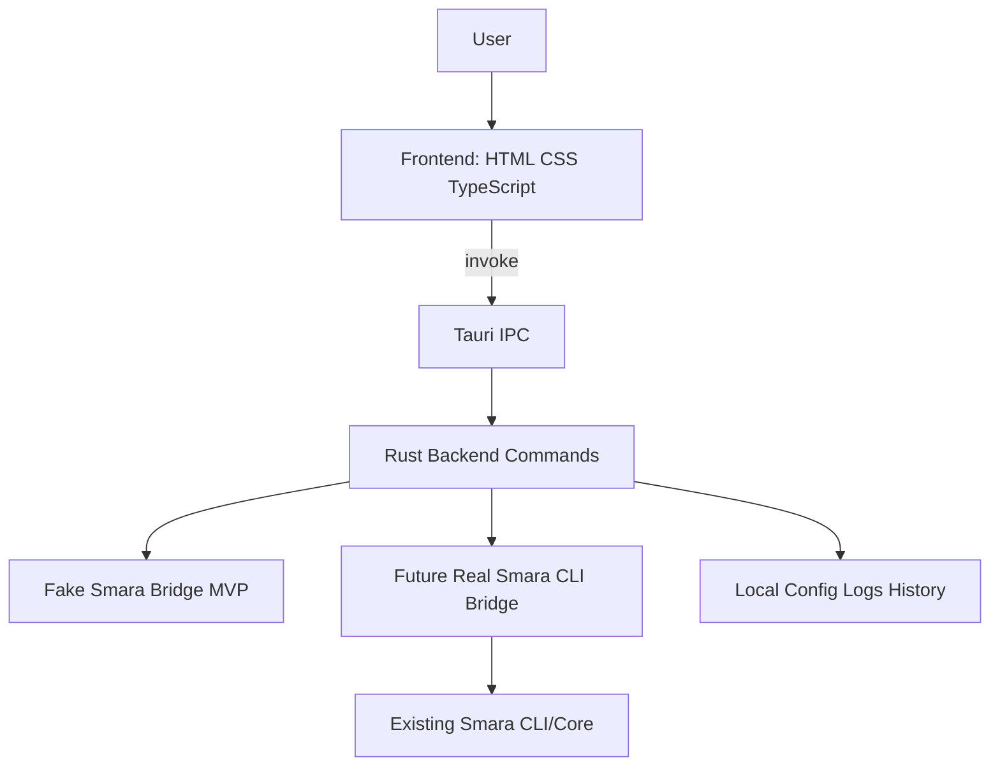

# Smara Desktop Rust Architecture

## Overview

Smara Desktop Rust is a lightweight desktop shell around Smara capabilities. The initial version uses Tauri v2 and keeps the existing Smara CLI as the future source of truth for agent execution.



## Components

### Frontend

Responsibilities:

- Render prompt input and output panel.
- Invoke Rust backend commands through Tauri IPC.
- Display status, success, and error messages.
- Stay dependency-light for fast startup.

Initial files:

- `index.html`
- `src/main.ts`
- `src/styles.css`

### Rust backend

Responsibilities:

- Expose Tauri commands.
- Implement fake CLI bridge for MVP.
- Later manage process execution for the real Smara CLI.
- Enforce safety boundaries for mutating operations.

Initial command:

```rust
#[tauri::command]
fn run_fake_smara(prompt: String) -> Result<String, String>
```

### CLI bridge

MVP bridge:

- Returns deterministic text.
- Does not spawn external processes.

Future bridge:

- Finds the Smara CLI binary.
- Runs commands with controlled arguments.
- Streams stdout/stderr.
- Captures exit code.
- Applies approval gates for risky actions.

### Local storage

Future local data can include:

- App settings.
- CLI binary path.
- Recent prompts.
- Run history.
- Audit log.

Storage options should remain simple at first:

- JSON/TOML config for settings.
- SQLite only when queryable history becomes necessary.

## Security notes

- Never pass untrusted strings directly into a shell.
- Prefer process spawning with explicit args.
- Add an approval layer before destructive commands.
- Keep logs local unless the user explicitly exports them.
- Avoid storing secrets in plaintext config.

## Performance goals

- Fast startup.
- Minimal frontend dependencies.
- Small memory footprint compared with Electron-style apps.
- No background services unless explicitly enabled.

## Road to real integration

1. Keep fake bridge stable.
2. Add CLI binary detection.
3. Add controlled command execution.
4. Add streaming output.
5. Add approval prompts.
6. Add run history and diagnostics.
